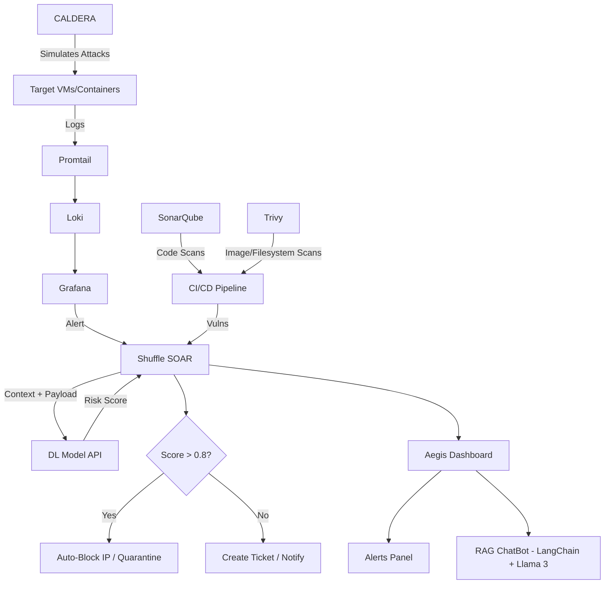

# 🛡️ Aegis — AI-Augmented Cyber Defense Platform

> *Detect. Filter. Explain. Respond.*

**Aegis** is an intelligent, automated cybersecurity operations platform that simulates real-world attacks, filters noise with deep learning, and explains threats in plain language via an AI-powered RAG chatbot — all within a unified analyst dashboard.

Built for **SOC teams**, **threat hunters**, and **DevSecOps engineers** who want to reduce alert fatigue, accelerate response, and understand *why* something is malicious — not just *that* it is.

---

## 🚀 Features

✅ **MITRE ATT&CK Simulation**  
Uses **CALDERA** to generate realistic attack telemetry — credential harvesting, lateral movement, persistence — to test your defenses under fire.

✅ **Observability Stack**  
Collects logs via **Promtail → Loki → Grafana** for real-time dashboards, alert rules, and historical analysis.

✅ **AI-Powered Alert Filtering**  
A **deep learning model** scores each alert (0.0–1.0) to:
- 🟢 Suppress false positives (< 0.3)
- 🟡 Escalate for review (0.3–0.8)
- 🔴 Trigger auto-response (> 0.8)

✅ **Unified Analyst Dashboard**  
Split-screen UI:
- **Left Panel**: Real-time alert list with MITRE Tactic, risk score, source IP.
- **Right Panel**: **RAG ChatBot** (powered by **LangChain + Llama 3**) that:
  - Explains the alert in plain English
  - Suggests remediation steps
  - Answers questions: “Why was this triggered?” or “Show me similar incidents”
  - Accepts image uploads (e.g., screenshot of log) → OCR → RAG → explanation

✅ **DevSecOps Integration**  
Adds **shift-left security** to your pipeline:
- 🐛 **SonarQube**: Scans for code smells, vulnerabilities, and security hotspots in your apps.
- 🐳 **Trivy**: Scans container images + filesystems for CVEs, misconfigurations, secrets.

✅ **Automated Response**  
Integrates with **Shuffle SOAR** to:
- Block IPs
- Quarantine containers
- Create Jira tickets
- Notify via Slack/Email

✅ **Lightweight & Scalable**  
Runs on **K3s (Lightweight Kubernetes)** — perfect for labs, edge, or cloud.

---

## 🧩 Architecture Overview



> 💡 *Tip: Replace this with an actual architecture diagram image in your repo.*

---

## 🛠️ Tech Stack

| Category             | Tools & Frameworks                                  |
|----------------------|-----------------------------------------------------|
| **Attack Simulation**| MITRE CALDERA                                       |
| **Observability**    | Promtail, Loki, Grafana                             |
| **AI/ML**            | TensorFlow/PyTorch, Scikit-learn, FastAPI (DL API)  |
| **RAG ChatBot**      | LangChain, Llama 3 (7B/8B), Chroma/FAISS, FastAPI   |
| **SOAR**             | Shuffle                                             |
| **DevSecOps Scans**  | SonarQube (Code), Trivy (Images + FS)               |
| **Frontend**         | React/Next.js or Streamlit                          |
| **Backend**          | FastAPI                                             |
| **Orchestration**    | K3s (Lightweight Kubernetes), Docker, Helm           |
| **Notifications**    | Slack, Email, n8n (optional)                        |

---

## ⚙️ Installation & Setup

### Prerequisites

- Docker + Docker Compose
- Python 3.10+
- K3s cluster (or Minikube)
- Node.js (if using React frontend)

---

### 1. Clone the Repo

```bash
git clone https://github.com/yourusername/Aegis.git
cd Aegis
```

---

### 2. Deploy Core Stack (Loki + Grafana + Shuffle + DL API)

```bash
cd deploy/core
docker-compose up -d
```

---

### 3. Deploy K3s + Helm Apps (Optional)

```bash
curl -sfL https://get.k3s.io | sh -
helm install aegis ./charts/aegis-platform
```

---

### 4. Launch CALDERA Attack

```bash
python3 launch_caldera_attack.py --operation credential-harvest --adversary apt29
```

---

### 5. Start RAG ChatBot (Llama 3 + LangChain)

```bash
cd rag-chatbot
pip install -r requirements.txt
python3 app.py  # Serves on http://localhost:8001
```

---

### 6. Access Dashboard

- **Aegis Dashboard**: `http://localhost:3000`
- **Grafana**: `http://localhost:3001` → pre-loaded dashboards
- **Shuffle**: `http://localhost:3333` → view/playbook execution
- **SonarQube**: `http://localhost:9000`
- **Trivy Scans**: Integrated into CI/CD or run manually:

```bash
trivy image your-app:latest
trivy fs /path/to/code
```

---

### 7. Configure Playbooks

Edit `playbooks/shuffle/auto_response.yaml`:

```yaml
steps:
  - name: Check Risk Score
    action: dl_model.predict
    args:
      log_event: "{{ alert.payload }}"
  - name: Block if High Risk
    if: result.score > 0.8
    action: firewall.block_ip
    args:
      ip: "{{ alert.source_ip }}"
  - name: Notify SOC
    action: n8n.trigger_webhook
    args:
      url: "https://n8n.yourcompany.com/webhook/slack-alert"
      payload:
        text: "🚨 Aegis Alert: High-risk event from {{ alert.source_ip }}. Action taken: IP Blocked."
```

---

## 🤝 Contributing

We welcome contributions! Here’s how:

1. Fork the repo
2. Create your feature branch (`git checkout -b feature/AmazingFeature`)
3. Commit your changes (`git commit -m 'Add some AmazingFeature'`)
4. Push to the branch (`git push origin feature/AmazingFeature`)
5. Open a Pull Request

Please ensure your code follows PEP8 and includes documentation.

---

## 📜 License

Distributed under the **MIT License**. See `LICENSE` for more information.

---

## 📬 Contact

**Hafedh Guenichi** — [your.email@example.com](mailto:hafedhgunichi@gmail.com)  
Project Link: [https://github.com/yourusername/Aegis](https://github.com/hafedh049/Aegis)

---

## 🌟 Acknowledgments

- MITRE for CALDERA
- Grafana Labs for Loki + Grafana
- Shuffle Team
- LangChain & Llama 3 communities
- SonarSource & Aqua Security (Trivy)
- Inspired by DeceptiNet & CyberLab academic projects

---

> 💡 **Pro Tip**: Add a `demo.gif` showing the split-screen dashboard + RAG chatbot in action — instantly demonstrates UX and AI value.

---
